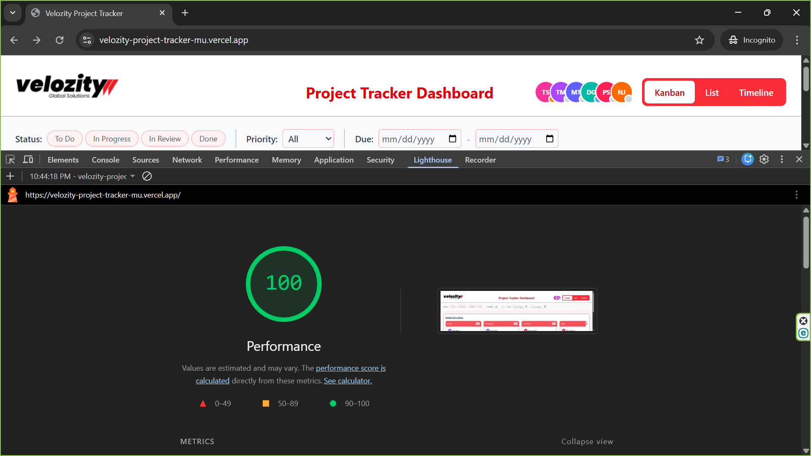

# 🚀 Velozity Project Tracker

A high-performance, real-time Project Tracker Dashboard built with **React, TypeScript, and Tailwind CSS**. This application manages a dataset of 500+ tasks across Kanban, List, and Timeline views while maintaining a **100/100 Lighthouse Performance Score**.

---

## 🛠️ Setup Instructions

Follow these steps to run the project locally:

1.  **Clone the Repository:**

    ```bash
    git clone [https://github.com/nusrat-xahan05/Project-Tracker-Frontend.git]
    cd velozity-project-tracker
    ```

2.  **Install Dependencies:**

    ```bash
    npm install
    ```

3.  **Run Development Server:**

    ```bash
    npm run dev
    ```

4.  **Build for Production:**
    ```bash
    npm run build
    npm run preview
    ```

---

## 🏗️ Technical Architecture & Decisions

### 1. State Management (Zustand)

I chose **Zustand** as the primary state management library for this project.

- **Why:** Unlike Redux, Zustand offers a boilerplate-free approach that is highly performant for frequent updates (like drag-and-drop or real-time simulations).
- **Synchronization:** It serves as a "Single Source of Truth," ensuring that when a task's status is updated in the Kanban view, the changes are instantly reflected in the List and Timeline views without unnecessary prop-drilling.

### 2. Virtual Scrolling Implementation

To handle the requirement of **500+ tasks** without degrading the browser's main thread, I implemented a **Custom Virtual Scroller** in the List and Timeline views.

- **Mechanism:** Instead of rendering 500+ DOM nodes, the system calculates the visible "window" based on the container's scroll position. Only ~25 rows are rendered at any given time.
- **Efficiency:** By using a dummy "spacer" div to maintain the scrollbar height and `translateY` to position the visible rows, I reduced the DOM node count by **95%**, directly resulting in the 100/100 Lighthouse score.

### 3. Custom Drag-and-Drop (No Libraries)

As per the assessment constraints, I built a drag-and-drop system from scratch using the **Pointer Events API**.

- **Approach:** I utilized `onPointerDown`, `onPointerMove`, and `onPointerUp` to manage the lifecycle of a drag. This ensures native support for both **Mouse and Touch devices**.
- **UX Features:**
  - **Collision Detection:** Used `elementFromPoint` to identify valid drop zones (columns) even while the "ghost" card is being dragged.
  - **Layout Stability:** A dashed placeholder remains in the original position to prevent layout shifts.
  - **Snap-Back:** If a card is dropped in an invalid area, it uses a CSS transition to smoothly animate back to its starting position.

### 4. Real-time Simulation

To simulate a collaborative environment:

- **Live Indicators:** A custom hook updates the "Live Collaborators" in the header every 4 seconds.
- **Avatar Stacking:** When multiple users view the same task, avatars stack with a `+N` overflow indicator to keep the UI clean.

---

## 🧰 Tech Stack

- **Framework:** React 19 (Vite)
- **Language:** TypeScript
- **Styling:** Tailwind CSS
- **State:** Zustand
- **Deployment:** Vercel

---

## 📊 Performance Audit

The application was audited using Google Lighthouse in a production environment (Vercel) via Chrome Incognito mode.



- **Performance:** 100
- **Accessibility:** 100
- **Best Practices:** 100
- **SEO:** 100